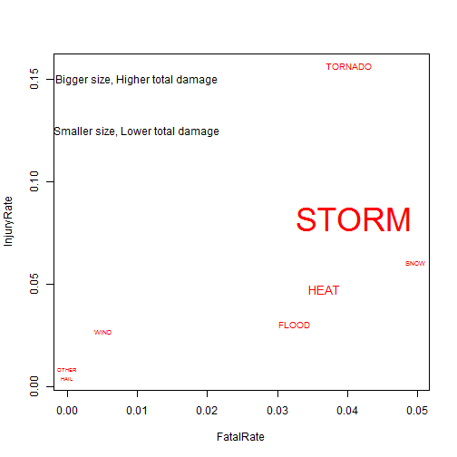

The Weather Events Analysis
========================================================

This project try to answer two questions:
* Across the United States, which types of events (as indicated in the `EVTYPE` variable) are most harmful with respect to population health?
* Across the United States, which types of events have the greatest economic consequences?

The other detail about the project can be found on Coursera website.

#  Data Processing 
The raw data can't be read into R completly, the `REMARK` variable is too big to cotains in one column, so, I 
just read a part of row. I load just 7 variable which is `EVTYPE`,`FATALITIES`,`INJURIES`,`PROPDMG`,`PROPDMGEXP`,`CROPDMG` and `CROPDMGEXP`  

```r
StormData = read.csv("repdata-data-StormData.csv", sep = ",", header = TRUE, 
    stringsAsFactors = FALSE, nrows = 547362, colClasses = c(rep("NULL", 7), 
        "character", rep("NULL", 14), rep("numeric", 2), rep(c("numeric", "character"), 
            2), rep("NULL", 9)))
head(StormData)
```

```
##    EVTYPE FATALITIES INJURIES PROPDMG PROPDMGEXP CROPDMG CROPDMGEXP
## 1 TORNADO          0       15    25.0          K       0           
## 2 TORNADO          0        0     2.5          K       0           
## 3 TORNADO          0        2    25.0          K       0           
## 4 TORNADO          0        2     2.5          K       0           
## 5 TORNADO          0        2     2.5          K       0           
## 6 TORNADO          0        6     2.5          K       0
```

Now, I will show you how I clean the data to be ready for data analysis, fist of all, I transfer the following three variables to capital letter.

```r

StormData$EVTYPE = toupper(StormData$EVTYPE)
StormData$PROPDMGEXP = toupper(StormData$PROPDMGEXP)
StormData$CROPDMGEXP = toupper(StormData$CROPDMGEXP)
```

The reduce data is named `StormDataV1` that remove the meanningless symbol in variabe `PROPDMGEXP` and `CROPDMGEXP` like ``, `+`, `-` and `?`. 

```r

index = !(StormData$CROPDMGEXP == "?" | StormData$CROPDMGEXP == "" | StormData$PROPDMGEXP == 
    "?" | StormData$PROPDMGEXP == "" | StormData$PROPDMGEXP == "-" | StormData$PROPDMGEXP == 
    "+")
StormDataV1 = StormData[index, ]
```

Change variabe `PROPDMGEXP` and `CROPDMGEXP` to numeric class which unit is USD.

```r
StormDataV1$PROPDMGEXP = ifelse(StormDataV1$PROPDMGEXP == "K", 1000, ifelse(StormDataV1$PROPDMGEXP == 
    "M", 1e+06, ifelse(StormDataV1$PROPDMGEXP == "B", 10^9, ifelse(StormDataV1$PROPDMGEXP == 
    0, 1, ifelse(StormDataV1$PROPDMGEXP == 3, 10, 10^5)))))
StormDataV1$CROPDMGEXP = ifelse(StormDataV1$PROPDMGEXP == "K", 1000, ifelse(StormDataV1$PROPDMGEXP == 
    "M", 1e+06, ifelse(StormDataV1$PROPDMGEXP == "B", 10^9, 1)))
```

There are numbers of different types of weather events, so, what I do next is to group it to 8 groups. The detail shows at the following code.

```r
tornado.index = grep("TORNADO|GUSTNADO|WATERSPOUT", StormDataV1$EVTYPE, ignore.case = TRUE)
tonado.class = unique((StormDataV1$EVTYPE)[tornado.index])
storm.index = grep("STORM|TYPHOON|HURRICANE|LIGHT", (StormDataV1$EVTYPE)[-tornado.index], 
    ignore.case = TRUE)
storm.class = unique(((StormDataV1$EVTYPE)[-tornado.index])[storm.index])
wind.index = grep("WIND", ((StormDataV1$EVTYPE)[-tornado.index])[-storm.index], 
    ignore.case = TRUE)
wind.class = unique((((StormDataV1$EVTYPE)[-tornado.index])[-storm.index])[wind.index])
flood.index = grep("FLOOD|RAIN|FLD", (((StormDataV1$EVTYPE)[-tornado.index])[-storm.index])[-wind.index], 
    ignore.case = TRUE)
flood.class = unique(((((StormDataV1$EVTYPE)[-tornado.index])[-storm.index])[-wind.index])[flood.index])
hail.index = grep("HAIL", ((((StormDataV1$EVTYPE)[-tornado.index])[-storm.index])[-wind.index])[-flood.index], 
    ignore.case = TRUE)
hail.class = unique((((((StormDataV1$EVTYPE)[-tornado.index])[-storm.index])[-wind.index])[-flood.index])[hail.index])
heat.index = grep("HEAT|FIRE|DRY|DROUGHT", (((((StormDataV1$EVTYPE)[-tornado.index])[-storm.index])[-wind.index])[-flood.index])[-hail.index], 
    ignore.case = TRUE)
heat.class = unique(((((((StormDataV1$EVTYPE)[-tornado.index])[-storm.index])[-wind.index])[-flood.index])[-hail.index])[heat.index])
snow.index = grep("SNOW|BLIZZARD|COLD|FREEZE|ICE|ICY", ((((((StormDataV1$EVTYPE)[-tornado.index])[-storm.index])[-wind.index])[-flood.index])[-hail.index])[-heat.index], 
    ignore.case = TRUE)
snow.class = unique((((((((StormDataV1$EVTYPE)[-tornado.index])[-storm.index])[-wind.index])[-flood.index])[-hail.index])[-heat.index])[snow.index])
other.class = unique((((((((StormDataV1$EVTYPE)[-tornado.index])[-storm.index])[-wind.index])[-flood.index])[-hail.index])[-heat.index])[-snow.index])
```

The clean data set `CleanData` has five variable, `EVGROUP` is available at previous step, `PropDmg` and `CropDmg` are simply `PROPDMG` times `PROPDMGEXP` and `CROPDMG` times `CROPDMGEXP`, `FATALITIES` and `INJURIES` are same as `StormDataV1` 

```r
EVGROUP = ifelse(StormDataV1$EVTYPE %in% tonado.class, "TORNADO", ifelse(StormDataV1$EVTYPE %in% 
    storm.class, "STORM", ifelse(StormDataV1$EVTYPE %in% wind.class, "WIND", 
    ifelse(StormDataV1$EVTYPE %in% flood.class, "FLOOD", ifelse(StormDataV1$EVTYPE %in% 
        hail.class, "HAIL", ifelse(StormDataV1$EVTYPE %in% heat.class, "HEAT", 
        ifelse(StormDataV1$EVTYPE %in% snow.class, "SNOW", "OTHER")))))))
FATALITIES = StormDataV1$FATALITIES
INJURIES = StormDataV1$INJURIES
PropDmg = StormDataV1$PROPDMG * StormDataV1$PROPDMGEXP
CropDmg = StormDataV1$CROPDMG * StormDataV1$CROPDMGEXP
CleanData = data.frame(EVGROUP, FATALITIES, INJURIES, PropDmg, CropDmg)
```


```r
head(CleanData)
```

```
##   EVGROUP FATALITIES INJURIES PropDmg CropDmg
## 1   STORM          2        0 1.0e+08      10
## 2   STORM          0        0 5.0e+06     500
## 3   STORM          0        0 2.5e+07       1
## 4   STORM          0        0 4.8e+07       4
## 5   STORM          0        0 2.0e+06      10
## 6   STORM          0        0 5.0e+04      50
```


# Method
The function `fatal.rate` and `injury.rate`  indicate the influence of population health. The rate is defined as **the percentage of the specific weather event causes  at least one died or injury**. 

```r

fatal.rate = function(x) {
    sub.data = CleanData[CleanData[, 1] == x, ]
    sum(sub.data[, 2] > 0)/length(sub.data[, 2])
}
injury.rate = function(x) {
    sub.data = CleanData[CleanData[, 1] == x, ]
    sum(sub.data[, 3] > 0)/length(sub.data[, 3])
}
```

The function `prop.dmg`, `crop.dmg` and `total.dmg`  indicate **the 
average of property damage, crop damage and total damage for specific weather event**.

```r

prop.dmg = function(x) {
    mean(CleanData[CleanData[, 1] == x, 4])
}
crop.dmg = function(x) {
    mean(CleanData[CleanData[, 1] == x, 5])
}
total.dmg = function(x) {
    mean(CleanData[CleanData[, 1] == x, 5] + CleanData[CleanData[, 1] == x, 
        4])
}
```


# Results
We can get the numeric result in the following two tables. 

```r

FatalRate = apply(cbind(c("TORNADO", "STORM", "WIND", "FLOOD", "HAIL", "HEAT", 
    "SNOW", "OTHER")), 1, fatal.rate)
InjuryRate = apply(cbind(c("TORNADO", "STORM", "WIND", "FLOOD", "HAIL", "HEAT", 
    "SNOW", "OTHER")), 1, injury.rate)
health.table = as.data.frame(rbind(FatalRate, InjuryRate))
colnames(health.table) = c("TORNADO", "STORM", "WIND", "FLOOD", "HAIL", "HEAT", 
    "SNOW", "OTHER")
health.table
```

```
##            TORNADO   STORM     WIND   FLOOD     HAIL    HEAT    SNOW
## FatalRate  0.04035 0.04098 0.005233 0.03256 0.000000 0.03663 0.04972
## InjuryRate 0.15658 0.08197 0.027132 0.03063 0.004191 0.04762 0.06077
##               OTHER
## FatalRate  0.000000
## InjuryRate 0.008696
```


```r

PropertyDamage = apply(cbind(c("TORNADO", "STORM", "WIND", "FLOOD", "HAIL", 
    "HEAT", "SNOW", "OTHER")), 1, prop.dmg)
CropDamage = apply(cbind(c("TORNADO", "STORM", "WIND", "FLOOD", "HAIL", "HEAT", 
    "SNOW", "OTHER")), 1, crop.dmg)
TotalDamage = apply(cbind(c("TORNADO", "STORM", "WIND", "FLOOD", "HAIL", "HEAT", 
    "SNOW", "OTHER")), 1, total.dmg)
damage.table = as.data.frame(rbind(PropertyDamage, CropDamage, TotalDamage))
colnames(damage.table) = c("TORNADO", "STORM", "WIND", "FLOOD", "HAIL", "HEAT", 
    "SNOW", "OTHER")
damage.table
```

```
##                  TORNADO     STORM      WIND     FLOOD      HAIL      HEAT
## PropertyDamage 2.768e+06 2.238e+07 407847.82 3.350e+06 162961.07 5.443e+06
## CropDamage     3.321e+01 2.489e+01     18.67 4.848e+01     35.97 1.687e+01
## TotalDamage    2.768e+06 2.238e+07 407866.50 3.350e+06 162997.04 5.443e+06
##                     SNOW OTHER
## PropertyDamage 935853.04 278.3
## CropDamage         18.16   0.0
## TotalDamage    935871.20 278.3
```

The following figure combines the information of population health and economic consequences, **the size of text represent the degree of total damage**.

```r

text.size = as.numeric(3 - (22392249 - damage.table[3, ])/8956780)
plot(FatalRate, InjuryRate, type = "n")
text(FatalRate, InjuryRate, c("TORNADO", "STORM", "WIND", "FLOOD", "HAIL", "HEAT", 
    "SNOW", "OTHER"), cex = text.size, col = 2)
text(0.01, 0.15, "Bigger size, Higher total damage")
text(0.01, 0.125, "Smaller size, Lower total damage")
```

 


Finally, we answer the original two questions
* **TORNADO is most harmful with respect to population health because the figure shows high fatal rate and high injury rate.**
* **STORM have the greatest economic consequences because the text size is biggest.**
